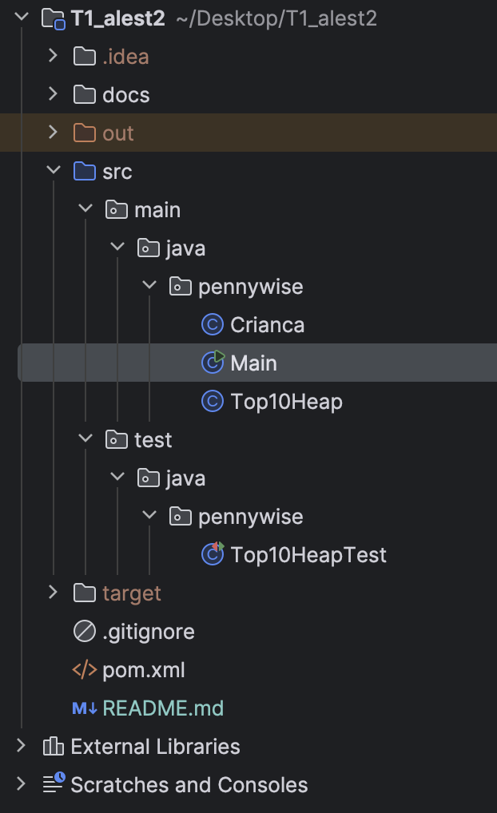
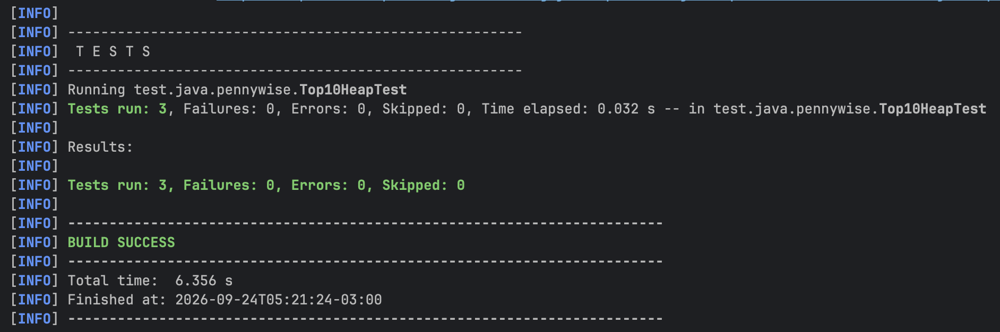

# ALEST II - T1: Pennywise e as 10 crianças mais covardes

## Apresentação do Projeto
Este software foi desenvolvido para resolver o problema de armazenamento de memória do Pennywise (ALEST II). O objetivo principal é manter um Top-10 das crianças mais covardes de Derry (aquelas que possuem os menores escores numéricos) coletadas a partir de múltiplos arquivos que representam as regiões da cidade.

Para satisfazer as restrições arquiteturais, o sistema processa a leitura de arquivos em fluxo (linha por linha) e nunca armazena o documento inteiro. A única estrutura de dados responsável pela triagem contínua é uma **Fila de Prioridade (Max-Heap)** limitada estritamente a 10 nós.

## Arquitetura e Organização
O sistema segue o padrão estrutural do Maven, separando o código-fonte principal das rotinas de teste. O repositório abriga os arquivos de requisitos e as regiões nos diretórios secundários, além de acomodar gráficos e imagens UML em `docs/imagens`.

Abaixo está o layout da disposição dos pacotes do projeto, com a separação clara entre a implementação em `src/main/java/pennywise` e as validações em `src/test/java/pennywise`[cit# ALEST II - T1: Pennywise e as 10 crianças mais covardes

## Apresentação do Projeto
Este software foi desenvolvido para resolver o problema de armazenamento de memória do Pennywise (ALEST II). O objetivo principal é manter um Top-10 das crianças mais covardes de Derry (aquelas que possuem os menores escores numéricos) coletadas a partir de múltiplos arquivos que representam as regiões da cidade.

Para satisfazer as restrições arquiteturais, o sistema processa a leitura de arquivos em fluxo (linha por linha) e nunca armazena o documento inteiro. A única estrutura de dados responsável pela triagem contínua é uma **Fila de Prioridade (Max-Heap)** limitada estritamente a 10 nós.

## Arquitetura e Organização
O sistema segue o padrão estrutural do Maven, separando o código-fonte principal das rotinas de teste. O repositório abriga os arquivos de requisitos e as regiões nos diretórios secundários, além de acomodar gráficos e imagens UML em `docs/imagens`.

Abaixo está o layout da disposição dos pacotes do projeto, com a separação clara entre a implementação em `src/main/java/pennywise` e as validações em `src/test/java/pennywise`[cite: 3]:

## Funcionamento e Algoritmos
A mecânica principal de seleção funciona em tempo real durante a leitura dos arquivos `txt`:
1. **Regra de Inserção:** Ao instanciar uma nova `Crianca` (com Nome e Escore), o algoritmo a injeta no `Top10Heap`.
2. **Descarte Automático:** Se a capacidade de 10 for extrapolada, a Fila de Prioridade automaticamente analisa o topo (a criança menos covarde até aquele ponto) e efetua um `poll()`, expulsando a que possui a maior nota do ranking. O desempate avalia a ordem alfabética.
3. **Ordenação sob Demanda:** Ao solicitar a visualização do ranking pelo CLI, o heap exporta temporariamente um Array que é processado internamente por uma adaptação própria do algoritmo **Insertion Sort**, devolvendo o grupo final de forma ordenada e crescente sem o uso de bibliotecas prontas do Java.

## Utilização do Sistema
A interação ocorre por uma Interface de Linha de Comando (CLI) controlada pela classe `Main`. Navegue inserindo os números correspondentes ou a nomenclatura literal da função:

- **`1` ou `consultar`:** Abre um submenu onde você indica o arquivo da região desejada (ex: `1` carrega as crianças de `centro.txt`). O ranking Top-10 é atualizado em tempo real.
- **`2` ou `mostrar`:** Exibe as crianças retidas no ranking atual.
- **`3` ou `limpar`:** Zera completamente o estado do Top-10.
- **`4` ou `ajuda`:** Traz informações a respeito dos atalhos de navegação.
- **`5` ou `sair`:** Finaliza a sessão.

## Testes Automatizados
A segurança das regras de negócio foi certificada a partir de testes unitários baseados na técnica de **Particionamento e Análise de Valor Limite** focados na capacidade máxima estipulada ($K=10$). A suíte com as três validações descritas abaixo foi aprovada com o status de `BUILD SUCCESS` sem nenhuma ocorrência de falha (`Failures: 0`) ou erro (`Errors: 0`), executando em apenas 0.032 segundos[cite: 2]:

- **Test On-Point:** Força a inserção em massa de exatos 10 itens. Valida o limite regular do array e garante que nenhuma falha de contenção ocorra no limite estabelecido da borda superior.
- **Test Off-Point:** Aplica uma carga com estresse excedente (11 itens inseridos sequencialmente, sendo o 11º um valor extremo de covardia). Valida a poda seletiva, conferindo se o maior valor anterior foi descartado para abrir vaga, e ratifica que a fila manteve seu tamanho congelado em 10.
- **Test Out-Point:** Confirma o bom funcionamento no escopo normal e na fronteira inferior (0 itens retidos ou lotação pacífica na marca de 1 inserção isolada).e: 3]:

## Funcionamento e Algoritmos
A mecânica principal de seleção funciona em tempo real durante a leitura dos arquivos `txt`:
1. **Regra de Inserção:** Ao instanciar uma nova `Crianca` (com Nome e Escore), o algoritmo a injeta no `Top10Heap`.
2. **Descarte Automático:** Se a capacidade de 10 for extrapolada, a Fila de Prioridade automaticamente analisa o topo (a criança menos covarde até aquele ponto) e efetua um `poll()`, expulsando a que possui a maior nota do ranking. O desempate avalia a ordem alfabética.
3. **Ordenação sob Demanda:** Ao solicitar a visualização do ranking pelo CLI, o heap exporta temporariamente um Array que é processado internamente por uma adaptação própria do algoritmo **Insertion Sort**, devolvendo o grupo final de forma ordenada e crescente sem o uso de bibliotecas prontas do Java.

<video src="docs/videos/Projeto_Pennywise__Max-Heap.mp4" width="100%" controls></video>

## Utilização do Sistema
A interação ocorre por uma Interface de Linha de Comando (CLI) controlada pela classe `Main`. Navegue inserindo os números correspondentes ou a nomenclatura literal da função:

- **`1` ou `consultar`:** Abre um submenu onde você indica o arquivo da região desejada (ex: `1` carrega as crianças de `centro.txt`). O ranking Top-10 é atualizado em tempo real.
- **`2` ou `mostrar`:** Exibe as crianças retidas no ranking atual.
- **`3` ou `limpar`:** Zera completamente o estado do Top-10.
- **`4` ou `ajuda`:** Traz informações a respeito dos atalhos de navegação.
- **`5` ou `sair`:** Finaliza a sessão.

## Testes Automatizados
A segurança das regras de negócio foi certificada a partir de testes unitários baseados na técnica de **Particionamento e Análise de Valor Limite** focados na capacidade máxima estipulada ($K=10$). A suíte com as três validações descritas abaixo foi aprovada com o status de `BUILD SUCCESS` sem nenhuma ocorrência de falha (`Failures: 0`) ou erro (`Errors: 0`), executando em apenas 0.032 segundos[cite: 2]:

- **Test On-Point:** Força a inserção em massa de exatos 10 itens. Valida o limite regular do array e garante que nenhuma falha de contenção ocorra no limite estabelecido da borda superior.
- **Test Off-Point:** Aplica uma carga com estresse excedente (11 itens inseridos sequencialmente, sendo o 11º um valor extremo de covardia). Valida a poda seletiva, conferindo se o maior valor anterior foi descartado para abrir vaga, e ratifica que a fila manteve seu tamanho congelado em 10.
- **Test Out-Point:** Confirma o bom funcionamento no escopo normal e na fronteira inferior (0 itens retidos ou lotação pacífica na marca de 1 inserção isolada).
